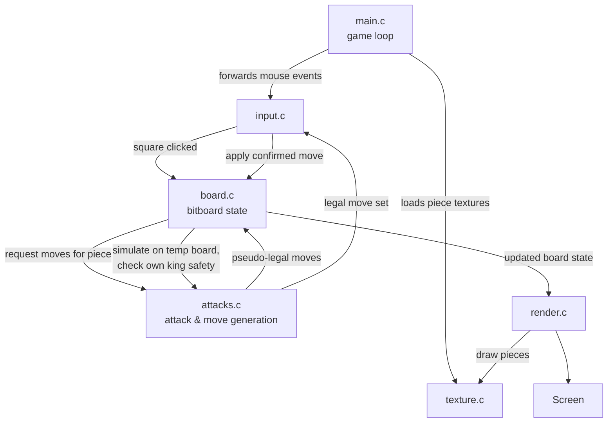

<div align="center">


# Chess

*A chess implementation written from the ground up in C — no chess libraries, no shortcuts.*


</div>

---

## What is this?

This is a chess game built entirely from scratch — board representation, move generation, and rule handling are all hand-written in C, rendered with [Raylib](https://www.raylib.com/). There's no third-party chess library doing the heavy lifting here. The point was never to ship a finished product quickly; it was to actually understand how a chess engine works internally, one rule at a time.

The board uses **bitboards** (64-bit integers, one bit per square) rather than an 8x8 array, which is the same representation used by most serious chess engines. It makes certain operations — attack generation, occupancy checks, sliding piece logic — reduce to bitwise arithmetic instead of nested loops.

> **Note**
> This is a work in progress. The game is fully playable move-to-move, but end-of-game detection (checkmate, stalemate, draws) and any form of AI opponent are not implemented yet. See [Current Progress](#current-progress) for the honest breakdown.

---

## Screenshots

<div align="center">

| Board & Pieces | Legal Move Highlighting |
|:---:|:---:|
|  |  |

</div>

<details>
<summary><strong>▸ More screenshots</strong></summary>
<br>

| Promotion Menu | Check Indicator |
|:---:|:---:|
|  |  |

</details>

<div align="center">


*(placeholder — gameplay recording goes here)*

</div>

---

## Features

| Feature | Status |
|---|:---:|
| Board rendering | ✅ |
| Piece textures | ✅ |
| Mouse-driven selection | ✅ |
| Legal move highlighting | ✅ |
| Turn management | ✅ |
| Bitboard board representation | ✅ |
| Move generation (all piece types) | ✅ |
| Captures | ✅ |
| Check detection | ✅ |
| Castling | ✅ |
| En passant | ✅ |
| Pawn promotion | ✅ |
| Legal move filtering | ✅ |
| Checkmate detection | ✅ |
| Stalemate detection | ✅ |
| Draw rules | 🚧 |
| PGN / FEN support | 🚧 |
| AI opponent | 🚧 |

---

## Architecture

Roughly how a single frame flows through the codebase — from a mouse click to pixels on screen:



`board.c` and `attacks.c` talk to each other constantly — board generates a candidate move, `attacks.c` checks whether it exposes the king, and the result flows back before anything is confirmed. Nothing is "legal" until it survives that round trip.

---

## Folder Structure

```
chess/
├── src/
│   ├── main.c          # entry point, game loop
│   ├── board.c/.h       # bitboard state, board setup, move application
│   ├── attacks.c/.h     # move generation, attack tables, check detection
│   ├── input.c/.h       # mouse handling, square/piece selection
│   ├── render.c/.h      # drawing the board, pieces, highlights
│   └── texture.c/.h     # texture loading for pieces
├── assets/
│   ├── textures/        # piece sprites
│   └── screenshots/
└── README.md
```

---

## Build Instructions

**Dependency:** [Raylib](https://www.raylib.com/) must be installed and available to your compiler/linker.

```bash
gcc src/*.c -o chess -lraylib -lGL -lm -lpthread -ldl -lrt -lX11
```

```bash
./chess
```

<details>
<summary><strong>▸ Platform-specific build instructions</strong></summary>

### Linux

Install Raylib using your package manager.

Ubuntu/Debian:

```bash
sudo apt install libraylib-dev
```

Arch Linux:

```bash
sudo pacman -S raylib
```

Compile:

```bash
gcc src/*.c -o chess \
-lraylib -lGL -lm -lpthread -ldl -lrt -lX11
```

Run:

```bash
./chess
```

---

### macOS

#### 1. Install Xcode Command Line Tools

```bash
xcode-select --install
```

#### 2. Install Homebrew (if not already installed)

```bash
/bin/bash -c "$(curl -fsSL https://raw.githubusercontent.com/Homebrew/install/HEAD/install.sh)"
```

#### 3. Install Raylib

```bash
brew install raylib
```

#### 4. Compile

**Apple Silicon (M1/M2/M3):**

```bash
clang src/*.c -o chess \
-I/opt/homebrew/include \
-L/opt/homebrew/lib \
-lraylib \
-framework OpenGL \
-framework Cocoa \
-framework IOKit \
-framework CoreVideo
```

**Intel Macs:**

```bash
clang src/*.c -o chess \
-I/usr/local/include \
-L/usr/local/lib \
-lraylib \
-framework OpenGL \
-framework Cocoa \
-framework IOKit \
-framework CoreVideo
```

Run:

```bash
./chess
```

---

### Windows (MSYS2 MinGW64)

Install Raylib:

```bash
pacman -S mingw-w64-ucrt-x86_64-raylib
```

Compile:

```bash
gcc src/*.c -o chess.exe \
-lraylib \
-lopengl32 \
-lgdi32 \
-lwinmm
```

Run:

```bash
./chess.exe
```

</details>

---

## Controls

| Action | Input |
|---|---|
| Select a piece | Left click on it |
| Move the selected piece | Left click a highlighted square |
| Promote a pawn | Automatic — a promotion menu appears on the 8th/1st rank |

---

## Project Highlights

A few things about the implementation that felt worth calling out:

- **No chess library, anywhere.** Board state, move rules, and legality checks are all custom.
- **Bitboards from the start** — not bolted on later. Every piece type and color has its own 64-bit board.
- **Legality is checked by simulation.** Moves are applied to a temporary board copy first; if the king ends up in check, the move never touches real state.
- **Modular by file, not just by function.** Rendering, input, board logic, and attack generation don't leak into each other — `render.c` has no idea how a move was validated, it just draws what `board.c` gives it.

---

## Current Progress

```
Core Mechanics        ████████████████████  complete
(bitboards, move generation, captures,
check, castling, en passant,
promotion, checkmate, stalemate)

Game End Conditions   ███████████████░░░░  mostly complete
(draw rules remaining)

Notation Support      ░░░░░░░░░░░░░░░░░░░░  not started

Engine / AI           ░░░░░░░░░░░░░░░░░░░░  not started
```

The bars above reflect implementation status, not code quality or effort — core mechanics being "complete" means the listed rules work, not that the engine is finished.

---

## Technical Details

<details>
<summary><strong>▸ Bitboard representation</strong></summary>
<br>

Each piece type/color pair gets its own 64-bit integer, one bit per square:

```c
typedef uint64_t Bitboard;

typedef struct {
    Bitboard white_pawns, white_knights, white_bishops,
             white_rooks, white_queens, white_king;
    Bitboard black_pawns, black_knights, black_bishops,
             black_rooks, black_queens, black_king;
} BoardState;
```

Combining these with bitwise OR gives derived boards like "all white pieces" or "all occupied squares" — no iteration required.

</details>

<details>
<summary><strong>▸ Move generation</strong></summary>
<br>

Non-sliding pieces (knight, king, pawn) use precomputed attack patterns shifted to the piece's square. Sliding pieces (bishop, rook, queen) walk along each direction ray, stopping at the first occupied square or the board edge, using bit shifts with file-wrap masks to avoid moves "wrapping" across the board.

</details>

<details>
<summary><strong>▸ Legal move filtering</strong></summary>
<br>

Move generation initially produces **pseudo-legal** moves — moves that follow the piece's pattern but might leave the king in check. Each candidate is applied to a temporary copy of the board:

```c
BoardState temp = current_board;
apply_move(&temp, move);

if (king_in_check(&temp, side_to_move)) {
    // discard — not legal
} else {
    // keep in the legal move set
}
```

Only moves that survive this check make it into the highlighted legal-move set the player actually sees.

</details>

<details>
<summary><strong>▸ Check detection</strong></summary>
<br>

The opposing side's full attack bitboard is generated, and the king's square is tested against it with a single AND operation. This same attack board is reused for castling legality (king can't castle through or into check) and for the legal-move filtering above.

</details>

---

## Challenges Faced

Things that took longer than expected, in no particular order:

- **Castling rights aren't part of the board itself.** Bitboards tell you *where* pieces are, not their history — so tracking whether a king or rook has ever moved required separate state alongside the boards.
- **En passant is a timing rule, not a position rule.** It's only legal the move immediately after a two-square pawn push, which meant tracking *when* something happened, not just *what* the position looks like.
- **Sliding piece edges.** Getting rook/bishop/queen rays to stop correctly at board edges (instead of wrapping to the next rank/file) took a few passes to get right with pure bit shifts.
- **Legality via simulation was the right call, but the first attempt tried to validate moves in-place** and ended up corrupting state on illegal moves. Switching to a temporary board copy fixed this cleanly.

---

## Future Plans

<details>
<summary><strong>▸ Roadmap</strong></summary>
<br>

- [ ] Checkmate detection
- [ ] Stalemate detection
- [ ] Draw rules (threefold repetition, fifty-move rule, insufficient material)
- [ ] FEN import/export
- [ ] PGN support
- [ ] Move history / undo
- [ ] Evaluation function
- [ ] Minimax search
- [ ] Alpha-beta pruning
- [ ] Basic AI opponent

</details>

---

## Contributing

This started as a solo learning project, but issues, suggestions, and pull requests are welcome. If you're fixing a bug or adding something, a short explanation of the reasoning behind the change is more useful than the diff itself.

---

## License

Licensed under the [MIT License](LICENSE).
